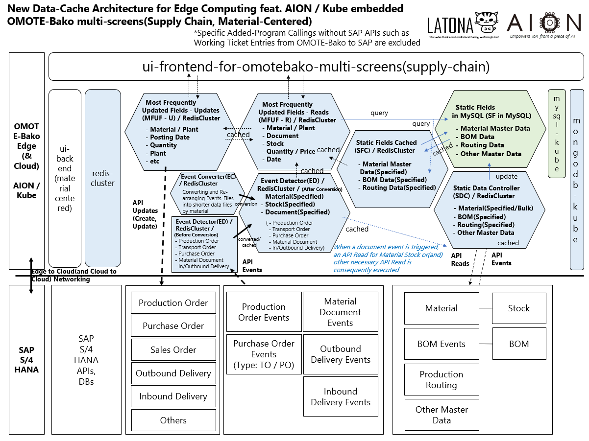

# rededge   

* Rededgeは、AION-Core / Kubernetes 上で動作する、エッジコンピューティングのための、Redisデータキャッシュアーキテクチャおよび関連リソースです。  
* RededgeはUIフロントエンドに対して素早く効率的なデータ供給を行い、サーバーサイドとのストレスフルなデータ通信を省略します。  
* Rededgeはクラスター化されそれぞれに相互連携したキャッシュデータ構造を持ち、特に複雑なERPシステムなどのバックエンドに対して連携させるとより強みを発揮します。

## Rededgeのアーキテクチャの一例（SAP S/4 HANAとLatona AION embedded の エッジアプリOMOTE-Bakoとの統合アーキテクチャ）

## Rededgeの機能

 * イベントのデータ連携       
  例えば在庫転送や製造指示/製造記録、製品の入出荷など、企業活動において高頻度で更新されるイベント情報は、より効率的にエンドポイントのフロントエンドUIに伝達される必要があります。  
  Rededgeは、バックエンドコアDBにおいて高頻度で起こるイベントを検知し、フロントエンドにデータを高速・安定的に供給します。    
  
 * マスタ情報の再構築とクラスター化    
  大規模ERPなどは複雑化されすぎて、フロントエンドUIに表示するには適切なデータ構造になっていない場合があります。  
  Redegdeは、エッジ端末内のクラスターの各ノードにおいて最適化されたデータ構造と、各ノード間の効率的なデータ通信・連携を提供します。  
   
 * 静的データ保持のための完全性  
  Redisキャッシュ技術は、基本的には動的・一時的なデータ維持保管に止まります。  
  Rededgeは動的なデータクラスター構造を維持しながらも、静的データの維持管理は同じエッジコンピューティング環境上におけるMySQLに委ね、これにより包括的なデータ完全性を担保します。
   
## 依存関係

Redegeは、AIONによるマイクロサービスアーキテクチャ・稼働環境と、AIONとともに動作するエッジKubernetesのコンテナオーケストレーション技術とにより、安定的に動作することができます。   
  
## formats  

Rededgeの下記JSONサンプルフォーマットを、formatsフォルダに格納しています。

 * MFUF_R_MC.json（Most Frequently Update Fields_Reads_Material Centered) 
 * EC_MC.json（Event Converter_Material Centered) 

## Rededgeを用いたエンドポイントUIの一例(サイネージ版)   
   

