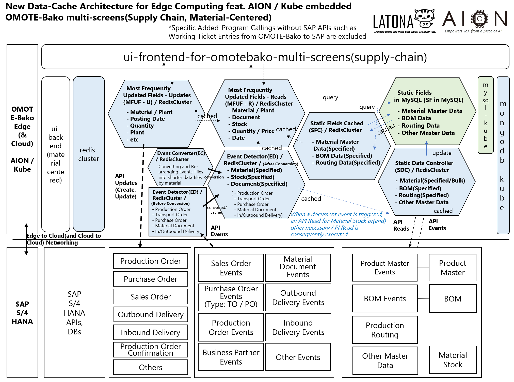
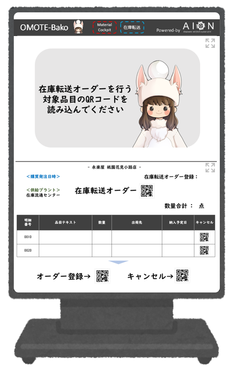

  

  A New Data-Cache Architecture for Edge Computing

***

# rededge   

* Rededgeは、AION-Core / Kubernetes 上で動作する、エッジコンピューティングのための、Redisデータキャッシュアーキテクチャおよび関連リソースです。  
* RededgeはUIフロントエンドに対して素早く効率的なデータ供給を行い、サーバーサイドとのストレスフルなデータ通信を省略します。  
* Rededgeはクラスター化されそれぞれに相互連携したキャッシュデータ構造を持ち、特に複雑なERPシステムなどのバックエンドに対して連携させるとより強みを発揮します。

## Rededgeのアーキテクチャの一例（SAP S/4 HANAとLatona AION embedded の エッジアプリOMOTE-Bakoとの統合アーキテクチャ）

## Latona における Rededge 関連リソースの SAP 領域・機能ごと の 整備状況
下の図において、チェックマークが付いている Rededge 関連 の リソースが、Latonaにおいて(少なくとも1次の)整備が行われたものであり、github上に公開されています。

## Rededgeの機能

 * イベントのデータ連携       
  例えば在庫転送や製造指示/製造記録、製品の入出荷など、企業活動において高頻度で更新されるイベント情報は、より効率的にエンドポイントのフロントエンドUIに伝達される必要があります。  
  Rededgeは、バックエンドコアDBにおいて高頻度で起こるイベントを検知し、フロントエンドにデータを高速・安定的に供給します。    
  
 * マスタ情報の再構築とクラスター化    
  大規模ERPなどは複雑化されすぎて、フロントエンドUIに表示するには適切なデータ構造になっていない場合があります。  
  Redegdeは、エッジ端末内のクラスターの各ノードにおいて最適化されたデータ構造と、各ノード間の効率的なデータ通信・連携を提供します。  
   
 * 静的データ保持のための完全性  
  Redisキャッシュ技術は、基本的には動的・一時的なデータ維持保管に止まります。  
  Rededgeは動的なデータクラスター構造を維持しながらも、静的データの維持管理は同じエッジコンピューティング環境上におけるMySQLに委ね、これにより包括的なデータ完全性を担保します。
   
## 依存関係

Redegeは、AIONによるマイクロサービスアーキテクチャ・稼働環境と、AIONとともに動作するエッジKubernetes、もしくは クラウド上の Kubernetes のコンテナオーケストレーション技術とにより、安定的に動作することができます。   
  
## formats  

Rededge の 下記 JSON フォーマット が、formats フォルダに格納されています。

 * MFUF_R_MC.json（Most Frequently Update Fields_Reads_Material Centered) 
 * EC_MC.json（Event Converter_Material Centered) 
 * SDC.json（Static Data Controller)
 
## samples

Rededge の 下記 JSON サンプルファイル（データの具体例が入ったもの）が、データの種類毎に、samples フォルダに格納されています。  

* MFUF_R_MC.sample（Most Frequently Update Fields_Reads_Material Centered のサンプル)   
* EC_MC_sample（Event Converter_Material Centered のサンプル)  
* SDC_sample（Static Data Controller のサンプル）  

## 動的なデータアーキテクチャだけではない SDC の用途

Rededge アーキテクチャは、動的なデータ構造だけでなく、静的なデータ構造も提供します。  
SDC(Static Data Controller)は、NoSQLだけでなく伝統的なSQLデータベース環境にも対応した、静的なデータのフォーマットを含みます。  
SDCは、次のような静的な、従来型の用途に利用されることができます。  

* マスタデータ維持管理用SQLのためのデータフォーマット（例：品目マスタ、ビジネスパートナ-得意先/仕入先、販売単価、部品表、作業手順、購買情報、設備マスタ）  
* トランザクションデータ維持管理用SQLのためのデータフォーマット（例：品目在庫、MRPデータ、製造指図、購買依頼、入出庫予定、計画独立所要量）  
* 帳票出力用データ維持管理用SQLのためのデータフォーマット（例：出荷指示書、納品書、請求書、内示通知書、製造指示書、発注書）  

## Rededge における SAP領域・機能 の選択基準
Rededge におけるSAP領域・機能は、SAP S4HANA のあらゆる領域・機能のうち、世界中の企業で繰り返し利用される、利用頻度の高いものと判断されるものが、選択されています。  

## SAP-SANDBOXとの依存関係

以下の図は、rededge と [sap-sandbox](https://github.com/latonaio/sap-sandbox) との依存関係を示した図です。（rededge は マイクロサービス であり、sap-sandbox と独立して動作します。sap-sandbox と組み合わせないと機能しないということではありません）  
REDEDGE は、SAP-SANDBOX との統合に関連して、以下の機能を提供します。

* Event Driven Dynamic Data Conversions（イベントドリブンの動的データ変換）  
* Hyper-Real-Time Data Interchange among Microservicies（マイクロサービス間の超リアルタイムデータ交換）
* Slimmed and Styled Data Formats against Traditional SQL Data Models（従来のSQLデータモデルに比べてスリム化されスタイルされたデータ形式）
* "Kubernetes-Fluent"（Kubernetes を使いこなす環境）
* 100% Optimizable to Edge Computing Stacks：On-the-Cloud will be OK as well （エッジコンピューティングスタックに100％最適化可能：そしてクラウドにおいても適用可能）

## Rededgeを用いたエンドポイントUIの一例(サイネージ版)   
   
